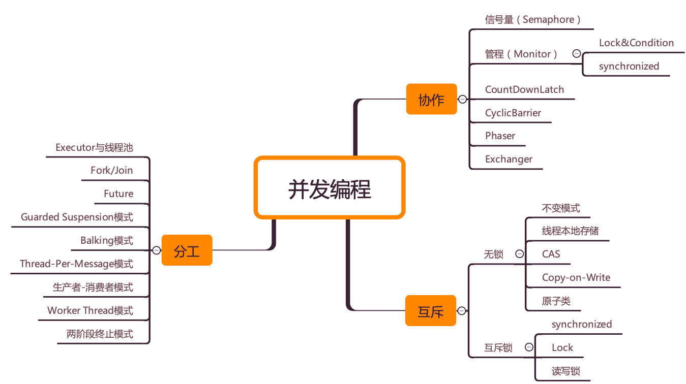

# Java 并发编程学习
基于的课程：
- 极客时间 《Java 并发编程实战》王宝令

## 并发编程的三大核心问题：
分工：高效的将现实任务拆解并分配给线程执行。

同步：线程之间如何协作。

互斥：保证共享资源在同一时刻只允许一个线程访问。

- 针对不同的问题，Java 中设计了不同的技术来解决。同时针对问题中具体的场景也有定制的技术。

## 鸡汤
1. 学习是反人类的，开始容易坚持难。
坚持是一个可贵的品质，一件事情，有的人三分钟热度，而有的人，一做就是一年，甚至更久。
2. 